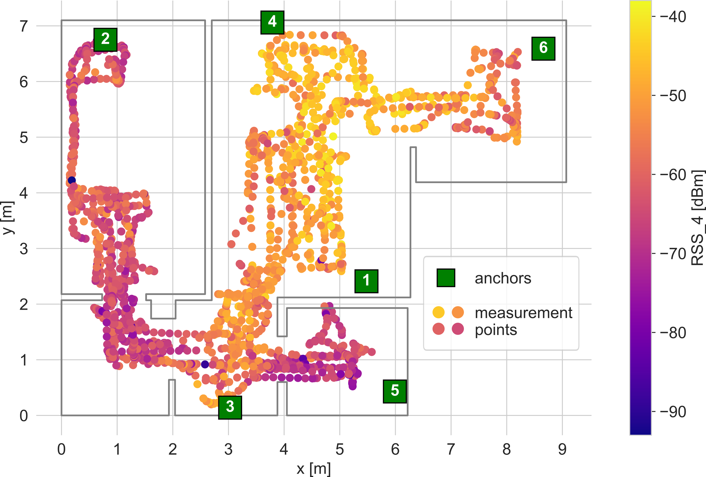

# Dataset: BLE RSS dataset for fingerprinting radio map calibration
[![CC BY 4.0][cc-by-shield]][cc-by] 

The dataset contains Bluetooth Low Energy signal strengths measured in a fully furnished flat.  The dataset was originally used in the study concerning RSS-fingerprinting based indoor positioning systems. The data were gathered using a hybrid BLE-UWB localization system, which was installed in the apartment and a mobile robotic platform equipped for a LiDAR. The dataset comprises power measurement results and LiDAR scans performed in 4104 points. The scans used for initial environment mapping and power levels registered in two test scenarios are also attached.

The set contains both raw and preprocessed measurement data. The Python code for raw data loading is supplied.

The detailed dataset description can be found in dataset_description file.

When using the datase consider citing the original paper. More information on Zenodo site and in the most recent commit on master branch.

This work is licensed under a
[Creative Commons Attribution 4.0 International License][cc-by].

[![CC BY 4.0][cc-by-image]][cc-by]

[cc-by]: http://creativecommons.org/licenses/by/4.0/
[cc-by-image]: https://i.creativecommons.org/l/by/4.0/88x31.png
[cc-by-shield]: https://img.shields.io/badge/License-CC%20BY%204.0-lightgrey.svg
